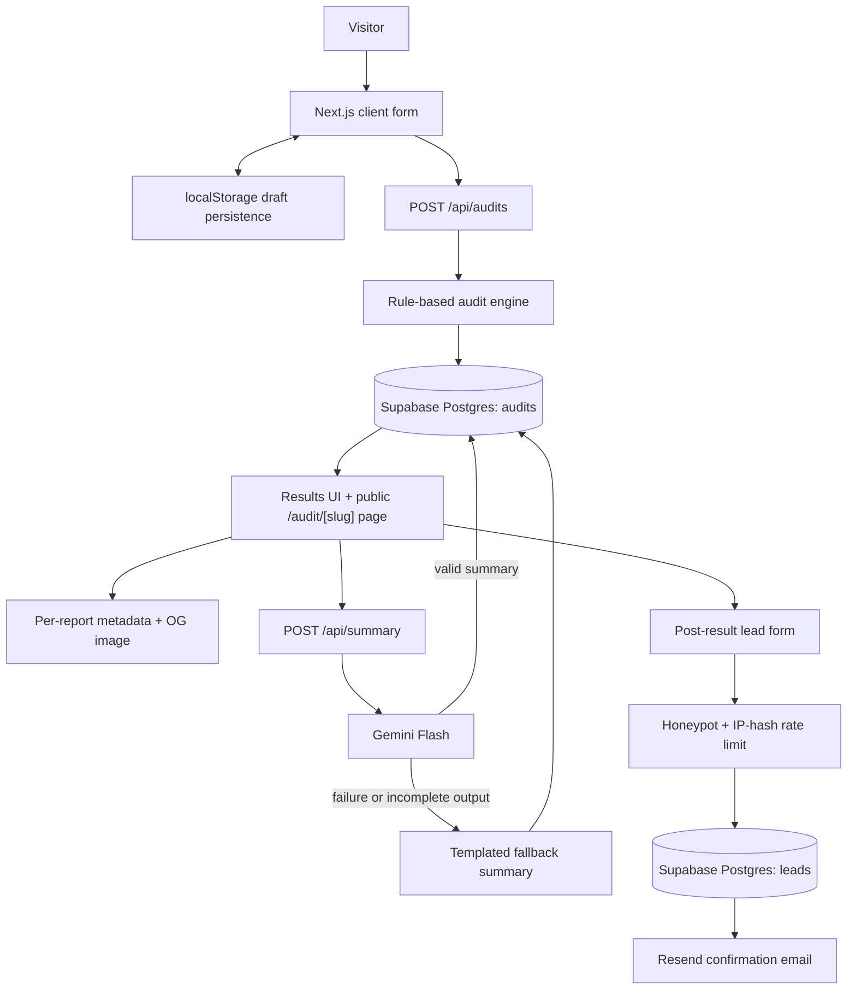

# Architecture

## System Diagram

## Data Flow

1. The visitor builds a spend profile containing team size, use case, and tool rows with plan/model, seats, and entered monthly spend. The unfinished draft is saved in `localStorage` so a refresh does not lose work.
2. On submit, `POST /api/audits` runs the audit engine again on the server. The client is not trusted as the source of calculated savings.
3. The engine compares each line item against verified pricing constants and selects the strongest non-overlapping recommendation per tool. It separately checks overlapping coding assistants.
4. The stored audit includes only tools, recommendations, totals, summary, and a generated slug. The public page reads this audit record. Lead fields are stored in a separate table and never selected for a public report.
5. `POST /api/summary` generates a narrative summary with Gemini. If the API is unavailable or returns an incomplete paragraph, a deterministic fallback is stored instead.
6. Only after results are shown can the visitor submit email, company, and role. The server checks a honeypot and a hashed-IP rate limit before storing a lead and sending a Resend confirmation email.

## Audit Logic

The financial calculations are deterministic TypeScript rules, not LLM output:

- Compare entered monthly spend with the selected public plan benchmark.
- Review API spend above `$200/month` with a conservative `20%` potential optimization estimate.
- Identify unused seats on team plans.
- Compare eligible team plans with cheaper same-vendor individual plans.
- For writing or research use cases, compare paid coding tools against Claude Pro where it is a named lower-cost alternative and Claude is not already in the stack.
- Flag multiple paid coding assistants as an overlap review.

Only the highest estimated recommendation for each individual tool is counted, avoiding double-counting two proposed ways of reducing the same line item. The UI calls results benchmark-based opportunities because actual bills can include credits, add-ons, negotiated prices, and deliberate burst usage.

## Stack Decisions

### Next.js App Router

SpendLens has three rendering needs: a stateful client form, server-rendered public audit pages with dynamic link metadata, and server endpoints for persistence, lead capture, email, and AI summary generation. A standalone SPA would need a separate backend for the same workflow. App Router keeps these boundaries in one TypeScript deployment while still rendering public pages on the server.

### Supabase Postgres

The data is relational: a saved audit may have leads, while rate limits are keyed by an action, a hashed IP, and a time window. Supabase provides PostgreSQL, SQL schema ownership, row-level security, and managed deployment. Public audit records and private lead records are deliberately separate so sharing a URL cannot expose email or company fields.

### Gemini With A Fallback

The assignment allows any LLM while preferring Anthropic. Gemini Flash was selected because API access could be configured without making Anthropic credits a launch blocker. The provider only generates summary prose; the audited numbers are rule-based. A fallback paragraph and output-quality check protect the user if Gemini fails or produces a truncated response.

### Resend

Resend gives the MVP a transactional email path without the IAM and sandbox setup required for SES. The email is sent after the lead is stored, and the application continues to preserve the lead even if delivery fails.

### Abuse Protection In Route Handlers

Lead rate limiting is performed in the API route using Supabase, rather than middleware. Middleware would need an edge-compatible store; adding a separate Redis service only for this MVP would add failure modes. The form also contains a honeypot to reject simple bot submissions.

## Security And Privacy Boundaries

- Secrets are environment variables; `.env.local` is ignored from git.
- Only server routes use the Supabase service-role key.
- Public reports select audit results only, never lead rows.
- Rate limiting hashes IP addresses before storing them.
- Open Graph descriptions contain savings totals but no identifying lead fields.

## Scaling To 10,000 Audits Per Day

At that volume, I would move rate limiting from Postgres row updates to an atomic edge-compatible store such as Upstash Redis, add request validation with Zod, queue email and summary generation outside the request path, and introduce monitoring for Gemini/Resend failure rates. I would also store pricing revisions separately from audit results so reports retain the benchmark version used at creation, and add an admin verification workflow when vendor prices become stale.

User interviews also suggested two future data fields: recurring extra-credit spend and how often a team hits usage limits. Those fields would improve Credex lead qualification without changing the core MVP flow.
