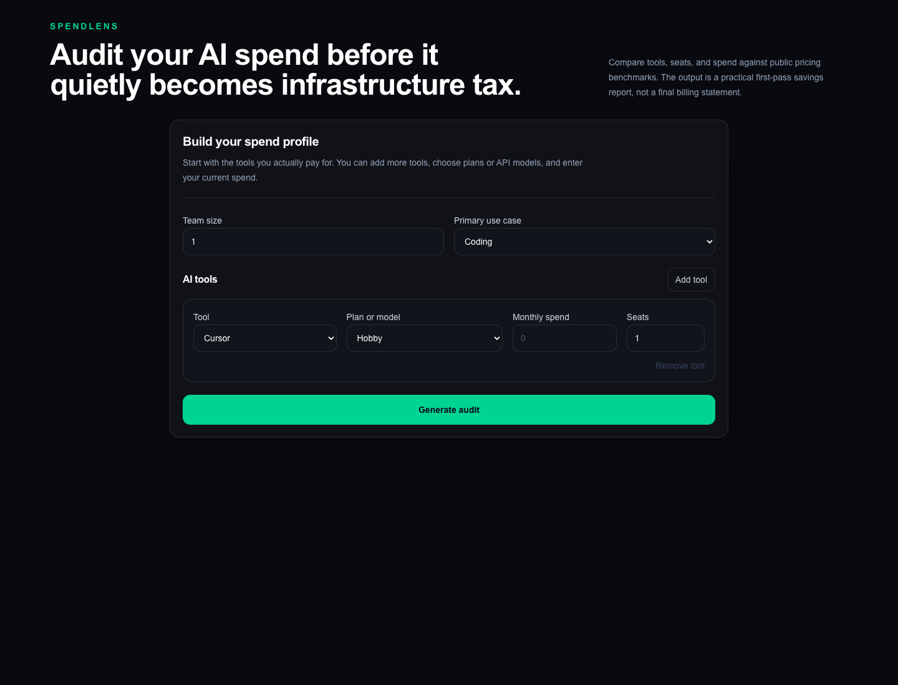
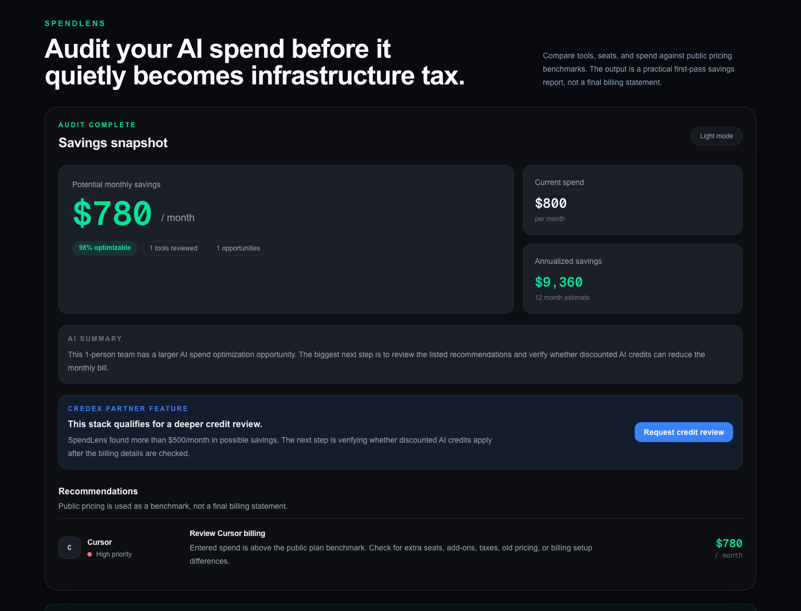
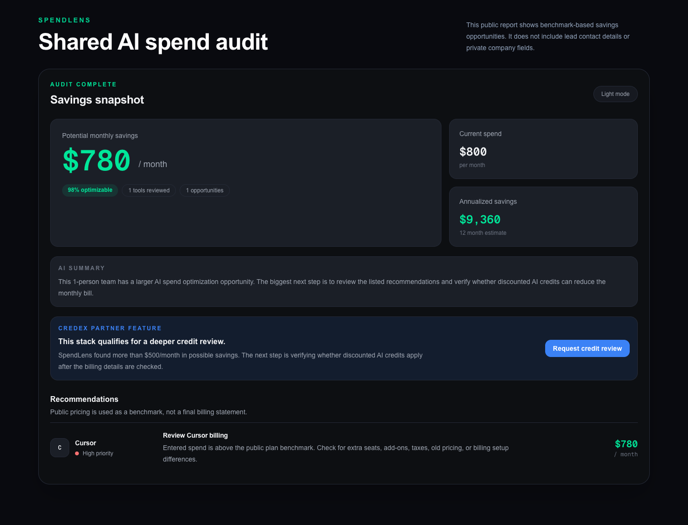

# SpendLens

SpendLens is a free AI spend audit for startup engineering teams. A user enters paid AI tools, plans, seats, monthly spend, team size, and use case; the app returns benchmark-based savings opportunities, an AI-written summary, and a shareable public report.

The initial buyer is a founder, engineering manager, or technical lead whose team is paying for AI subscriptions or recurring API credits but does not have a clear review process.

**Live app:** [https://spendlens-neon.vercel.app](https://spendlens-neon.vercel.app)

## Screenshots

### Spend Input



### Audit Results And Credit Review



### Public Share Page



## What It Does

- Supports Cursor, GitHub Copilot, Claude, ChatGPT, Anthropic API, OpenAI API, Gemini, and Windsurf.
- Persists form inputs across reloads using browser storage.
- Applies deterministic audit rules using cited public pricing data.
- Saves completed audits to Supabase and creates a public share URL.
- Exports a saved public report as a downloadable PDF.
- Generates a short Gemini summary, with a deterministic fallback if generation fails or returns incomplete text.
- Captures leads only after showing value, with a honeypot, rate limit, and Resend confirmation email.
- Shows a Credex credit-review path for high-savings audits.

## Quick Start

```bash
npm install
cp .env.example .env.local
npm run dev
```

Create a Supabase project and run [`supabase/schema.sql`](supabase/schema.sql) in its SQL editor. Then fill in `.env.local`:

```bash
NEXT_PUBLIC_SITE_URL=http://localhost:3000
NEXT_PUBLIC_SUPABASE_URL=
NEXT_PUBLIC_SUPABASE_ANON_KEY=
SUPABASE_SERVICE_ROLE_KEY=
RESEND_API_KEY=
RESEND_FROM_EMAIL=
GEMINI_API_KEY=
```

Run local verification:

```bash
npm run lint
npm run test
npm run build
```

## Deployment

The production app is deployed on Vercel. Add the same environment variables under the Vercel project's **Production** environment, set `NEXT_PUBLIC_SITE_URL` to the deployed domain, and redeploy. The Supabase service-role key is server-only and must never be exposed as a public environment variable.

## Decisions

1. **Next.js App Router instead of a client-only React SPA.** The product needs an interactive form, server API endpoints, server-rendered public reports, and per-report Open Graph metadata in one deployable application.
2. **Supabase Postgres instead of a document database.** Audits, leads, and rate-limit windows have relational ownership boundaries, while public reports must exclude private lead information.
3. **Rule-based audit math instead of LLM-generated savings.** Prices and savings need to be inspectable and testable. Gemini writes only the narrative summary, never the financial calculations.
4. **Public pricing benchmarks instead of calling extra spend “waste.”** Entered spend can include add-ons, taxes, urgent usage, or credits. Recommendations therefore ask users to review billing or usage rather than claim certainty.
5. **Post-value email capture instead of login or an email gate.** The report is visible first, then the user can request it or a Credex review. This follows both the assignment and feedback from user interviews.

## Supporting Documents

- [`ARCHITECTURE.md`](ARCHITECTURE.md)
- [`PRICING_DATA.md`](PRICING_DATA.md)
- [`TESTS.md`](TESTS.md)
- [`USER_INTERVIEWS.md`](USER_INTERVIEWS.md)
- [`GTM.md`](GTM.md)
- [`ECONOMICS.md`](ECONOMICS.md)
